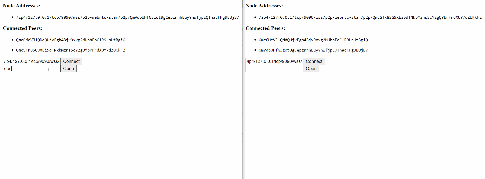

# CollabSwarm


_Share react stores between multiple clients (works on both browsers and servers) using eventually-consistent CRDTs!_

Implementing collaborative real-time applications can be very difficult and error prone.
CollabSwarm is a fully-baked real-time application data store built using CRDTs and
efficient distributed pub-sub algorithms.

CollabSwarm has official bindings for common webapp stores including:

* Redux (automerge-swarm-redux)
* More to come soon...

CollabSwarm has official bindings for the following CRDTs:

* [automerge](https://github.com/automerge/automerge)
* [Y.js](https://github.com/yjs/yjs/) (COMING SOON)

## Getting Started (Redux Bindings)

Install `automerge-swarm` and its redux bindings:

```sh
# Clone the automerge-swarm library somewhere
git clone https://github.com/robotoer/automerge-swarm

# Install package deps and link local dependencies
(cd automerge-swarm && npm install && npx lerna bootstrap --force-local)

# Build packages/automerge-swarm/dist
(cd automerge-swarm/packages/automerge-swarm && npm run tsc)

# Build packages/automerge-swarm-redux/dist
(cd automerge-swarm/packages/automerge-swarm-redux && npm run tsc)

# Change directories to the package/application you are working on.

# Installs automerge-swarm + automerge-swarm-redux as a local directory.
npm install --save \
    ./automerge-swarm/packages/automerge-swarm \      # Adjust these paths to point to the location
    ./automerge-swarm/packages/automerge-swarm-redux  # of automerge-swarm on your machine.
```

In the future we will support installation via NPM repositories:

```sh
# NOT CURRENTLY SUPPORTED!
npm install --save automerge-swarm automerge-swarm-redux
```

Define document types (only if you're using typescript)

```ts
// models.ts
export interface ExampleDocument {
  content: automerge.Text;

  // ...
}
```

Setup the client store (ensure you also initialize the store)

```ts
// reducers.ts
import { combineReducers, CombinedState } from "redux";
import { automergeSwarmReducer, AutomergeSwarmState, AutomergeSwarmActions } from "automerge-swarm-redux";


export type RootState = CombinedState<{
  automergeSwarm: AutomergeSwarmState<ExampleDocument>;

  // ...
}>

export const rootReducer = combineReducers({
  // Add the automerge-swarm-redux reducer to provide access to a store of opened documents.
  automergeSwarm: automergeSwarmReducer,

  // ...
});

// Provides easy access to the current version of the shared document.
export function selectAutomergeSwarmState(rootState: RootState): AutomergeSwarmState<ExampleDocument> {
  return rootState.automergeSwarm;
}
```

Initialize the swarm node

```ts
// App.tsx
import { AutomergeSwarmConfig } from "automerge-swarm";
import { initializeAsync, connectAsync, openDocumentAsync, closeDocumentAsync, changeDocumentAsync } from "automerge-swarm-redux";

// Use the actions connected below in your application's container(s) to interact with CollabSwarm.
function mapDispatchToProps(dispatch: ThunkDispatch<RootState, unknown, AutomergeSwarmActions>) {
  return {
    // To automatically add nodes to the list of peers on startup, add multi-addrs to: config.ipfs.config.Bootstrap
    initializeAutomergeSwarm: (config: AutomergeSwarmConfig) => dispatch(initializeAsync<WikiSwarmArticle, RootState>(config, state => state.automergeSwarm)),
    connectToPeer: (addresses: string[]) => dispatch(connectAsync(addresses, selectAutomergeSwarmState)),
    openDocument: (documentId: string) => dispatch(openDocumentAsync(documentId, selectAutomergeSwarmState)),
    closeDocument: (documentId: string) => dispatch(closeDocumentAsync(documentId, selectAutomergeSwarmState)),
    changeDocument: (documentId: string, changeFn: (current: any) => void, message?: string) => dispatch(changeDocumentAsync(documentId, changeFn, message, selectAutomergeSwarmState)),
  };
}

// ...
```

While `automerge-swarm-redux` automatically updates all open documents for you in its internal store,
if necessary the following actions are dispatched and can be used in your own reducers:

```ts
// packages/automerge-swarm-redux/src/actions.ts

export type AutomergeSwarmActions =
  InitializeAction |
  ConnectAction |
  OpenDocumentAction |
  CloseDocumentAction |
  SyncDocumentAction |
  ChangeDocumentAction |
  PeerConnectAction |
  PeerDisconnectAction;
```

"Login" a user

```ts
// TODO: Security/Access Control is an upcoming feature!
```

See the provided [examples](examples) for full examples.

## CRDTs

CRDTs provide a simple way to 

### CRDT Performance

Performance of CRDTs can be an issue depending on the
[implementation](https://github.com/dmonad/crdt-benchmarks). Generally, performance becomes worse
as the document's history of changes grows.

In the future, some sort of compaction mechanism could be added as an optional feature. Changes
could be compacted by truncating the history after a specific number of events or something more
advanced such as compacting events into increasing time or change-count intervals.

## Distributed Web

CollabSwarm uses libp2p/IPFS to distribute CRDT change messages between nodes. By using libp2p's
[GossipSub](https://github.com/libp2p/specs/tree/master/pubsub/gossipsub), this message exchange
should scale well beyond naiive broadcast/flood based solutions which can cause
[large network spikes](https://www.youtube.com/watch?v=mlrf1058ENY&index=3&list=PLuhRWgmPaHtRPl3Itt_YdHYA0g0Eup8hQ).
These changes are also cached on individual nodes using IPFS for initial document load and error
correction (when missing changes are detected).

### Browser p2p limitations

Currently the only transport that CollabSwarm supports for browser-browser
communication is libp2p-js-web-rtc-star. This protocol requires the usage of
a centralized signaling server and/or a relay (non-browser) node if the two
browsers connecting can't communicate due to NAT translation or firewall
problems. These libp2p mechanisms fill a role similar to WebRTC's TURN and STUN
protocols/services.

## Local Development

Lerna is used to link multiple npm packages together and ensure that dependency versions match
between packages.

To build automerge-swarm (plus its packages):

```
npm install
npx lerna bootstrap --force-local

cd packages/automerge-swarm
npm run tsc
cd ../..

cd packages/automerge-swarm-redux
npm run tsc
cd ../..
```

There is also a docker-compose.yaml file provided that runs the wiki-swarm example by default:

```sh
docker-compose build
docker-compose up
```

The browser-test can also be uncommented and run as well.
