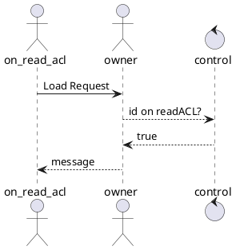

# Getting Started

prereqs: docker compose, docker desktop (if mac)


Launch these containers:
```
docker-compose up node star-signal browser-test
```

Open a browser to `http://localhost:3001/`

You should see a 'Node Address' with something like 'Node Addresses:
/ip4/127.0.0.1/tcp/9090/wss/p2p-webrtc-star/p2p/{id}'

If you do not see that, there may be something wrong with the docker file. 

Next, try opening another browser tab using Incognito or a different browser.
You should show a different node address, and each should connect to the other.

Example:
  Browser 1:
    Node Addresses:
      /ip4/127.0.0.1/tcp/9090/wss/p2p-webrtc-star/p2p/QmbbmZhpebBowNMztaphCBk7omfWvoW4zdi2gFfqPjFdDJ
    Connected Peers:
      QmZ8MUuxfNSegfCN5yquAWRS56Exr9omkcwxGaRHtYtxnW

  Browser 2:
    Node Addresses:
      /ip4/127.0.0.1/tcp/9090/wss/p2p-webrtc-star/p2p/QmZ8MUuxfNSegfCN5yquAWRS56Exr9omkcwxGaRHtYtxnW
    Connected Peers:
      QmbbmZhpebBowNMztaphCBk7omfWvoW4zdi2gFfqPjFdDJ

Then open a document in one, and the same document in the other. Both parties should be able to see edits by either party. 

## What is happening

Local node info from the web-rtc-star package is saved to an env file. This is then loaded as the config for the AutoSwarm object.

### Initial loading of document

Requestor has read access:
<!-- https://www.plantuml.com/plantuml -->


Requestor does not have load access:
```plantuml
@startuml
actor not_on_read_acl
actor owner
control control

not_on_read_acl -> owner: Load Request
owner --> control: id on readACL?
control --> owner: false
@enduml```