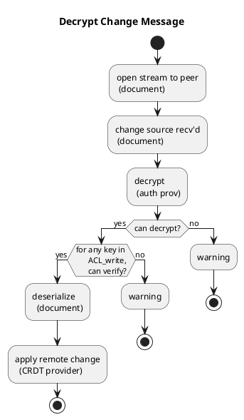
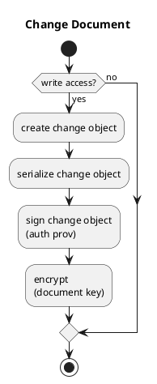

# Flow

## Decrypt Change Message

[[plantuml](
  http://www.plantuml.com/plantuml/uml/NP6nJiGm44HxVyLqv2I-u2Wub2kXGVJ8SZONYsHjhJSvcQ_7IHo1SBFIpFFCMhuajQBpD1hrEXAkv2H7HJjOlX7UA2LRfjamSmwH64c5x0GDY4HYq7J1pHEndfxCsUqNKvZ54OJSyj3zGxgzewXsrW5Hmb9atwDnbb7TvnDq86uofPC1LhSF0iiPNvJXsM0xB-thvrsyqcCLreo5nFUvHk3804frAfOT_JTL_CzcEs9Z73E4fg24_JK7shvVFxPrVKTI-QGX6e36H6Wur9wx5VPyMv43uCxtPiKgzSjinEvVoYYVyGC0
  )]

## Change Document

[[plantuml](
http://www.plantuml.com/plantuml/uml/RSz1hi8m30JGlK_XPNA5_iMl11S9wRGrf4aLkw1oUY8g5aWixMTBCxrQgBOjYKmiWKzpo1FuNEAs81lJsubaPFUeOk0G8rJ_FTkCp6w7UkfYHMWMZ-zokIBQ7tMAAY79yuV8bB-NJ6wjSWy6lc7txGOvrdqrSiCdpG582fUB9-H1HY9IAolrRMezNW00
  )]

References:
  https://jameshfisher.com/2017/11/02/web-cryptography-api-symmetric-encryption/
  https://www.tutorialsteacher.com/typescript/typescript-generic-class
  https://www.typescriptlang.org/docs/handbook/2/generics.html
  https://developer.mozilla.org/en-US/docs/Web/JavaScript/Typed_arrays 